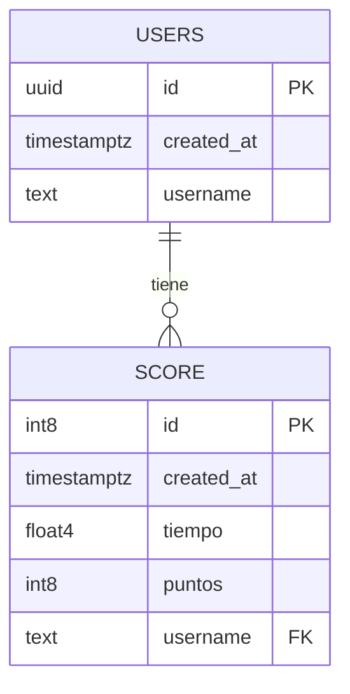

# Juego del Ahorcado - Programación

## Resumen

El presente informe analiza el desarrollo de una implementación digital del juego del ahorcado, enfocado en lenguajes de programación. Este proyecto forma parte de la materia Proyecto Diseño e Implementación, correspondiente al 7° año, 4a división de la Escuela de Educación Secundaria Técnica N°5. La aplicación se destaca por su interfaz gráfica simple y atractiva, la utilización de palabras relacionadas con lenguajes de programación, y una representación visual del ahorcado mediante ASCII art.

## Introducción

El juego del ahorcado es un pasatiempo clásico que ha sido adaptado a diversas plataformas y temáticas. En este caso, se ha desarrollado una versión digital orientada al ámbito de la programación, con el objetivo de familiarizar a los estudiantes con términos técnicos de manera lúdica. El proyecto no solo sirve como herramienta educativa, sino también como ejercicio práctico para la aplicación de conceptos de desarrollo web y programación.

## Metodología

### Tecnologías utilizadas

El proyecto se ha desarrollado utilizando una combinación de tecnologías web modernas:

- HTML5 para la estructura del documento
- CSS3 para el diseño y la presentación
- JavaScript para la lógica del juego y la interactividad
- Node.js como entorno de ejecución del servidor
- Express.js como framework para el desarrollo del backend
- Bun como gestor de paquetes y entorno de ejecución

### Estructura del proyecto

La organización del proyecto sigue una estructura modular:

```
.
├── node_modules/
├── public/
│   ├── css/
│   ├── js/
│   └── index.html
├── utils/
├── .gitignore
├── app.js
├── bun.lockb
├── jsconfig.json
├── package.json
└── README.md
```

Esta estructura facilita la separación de responsabilidades y mejora la mantenibilidad del código.

### Requisitos previos:

El proyecto utiliza una base de datos en Supabase para almacenar información de usuarios y puntuaciones. Se debe contar con una base de datos creada en Supabase para ejecutar el proyecto en local.

La estructura de la base de datos debería ser así



Por ultimo tomar como referencia el archivo `.env.example` que contiene las variables de entorno necesarias, y modificar las variables de `/public/js/supabaseClient.js` (estas son expuestas al cliente)

## Instalación y ejecución

Para instalar y ejecutar el proyecto:

1. Clonar el repositorio:
   ```
   git clone https://github.com/TomasDmArg/pdi-js10
   ```
2. Navegar al directorio del proyecto:
   ```
   cd pdi-js10
   ```
3. Instalar las dependencias usando Bun:
   ```
   bun install
   ```
4. Iniciar el servidor de desarrollo:
   ```
   bun run start
   ```

El juego estará disponible localmente en `http://localhost:3000`.

## Visualización en línea

El proyecto se encuentra disponible para su visualización y uso en línea en la siguiente dirección:

[https://pdi.tdm.ar/](https://pdi.tdm.ar/)

Esta versión en línea permite acceder al juego sin necesidad de instalación local, facilitando su uso y distribución entre los estudiantes y demás interesados.
